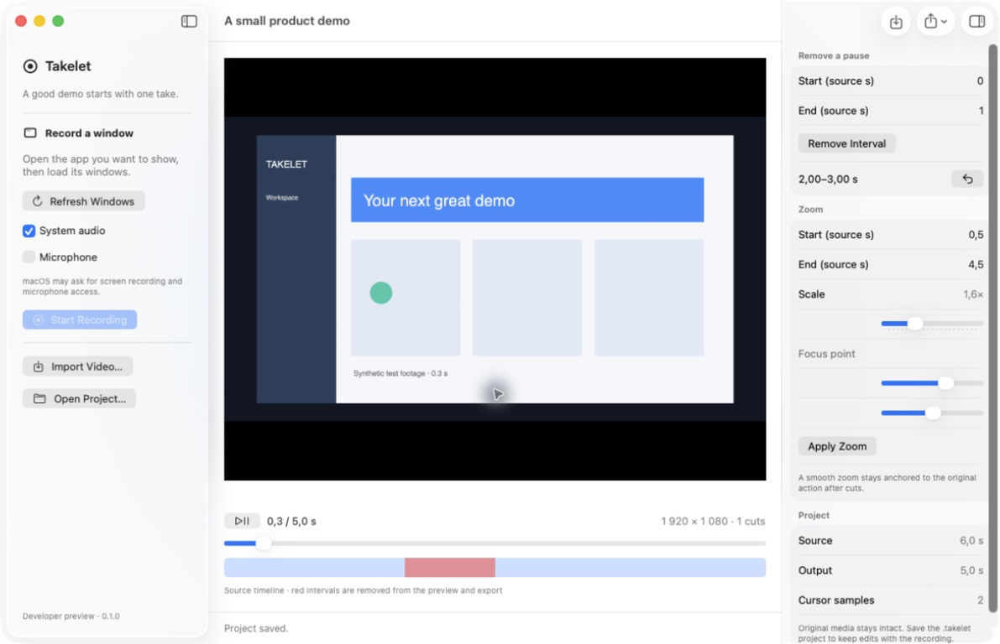

# Takelet

**Turn screen recordings into clear product demos.**

Takelet is a native macOS recorder and editor for short tutorials, feature announcements, and internal walkthroughs. Keep the original take, remove pauses, bring details closer, and export a video you can share.

**Developer preview · macOS 15+ · Apple Silicon · MIT**

[Project site](https://m0rg0t.github.io/takelet/) · [ChatGPT Sites](https://takelet.antonlenev.chatgpt.site/) · [Build from source](#build-and-run) · [Roadmap](docs/ROADMAP.md)

[**Download Takelet 0.1.0 for Apple Silicon**](https://github.com/m0rg0t/takelet/releases/download/v0.1.0/Takelet-0.1.0-arm64.dmg) — a Developer ID signed and Apple-notarized developer preview. Open the DMG, drag Takelet into Applications, then open the app. Requires macOS 15 or later; Intel Macs are not supported.

See the [release notes and checksums](https://github.com/m0rg0t/takelet/releases/tag/v0.1.0) and [roadmap](docs/ROADMAP.md). The experimental Codex analyzer remains available separately from source.



*The native editor in dark appearance, using generated test footage. See [Editor design](docs/DESIGN.md) for the design direction.*

## What works today

- Import one video and save a portable `.takelet` project containing its source and edits.
- Remove and restore source intervals, with undo/redo.
- Set one smooth zoom interval, its scale and focus point.
- Scrub a filmstrip of real source frames and see cuts and zoom timing on separate tracks.
- Choose one of four canvas backgrounds, adjust padding, and switch between system, light and dark appearance.
- Preview against a padded background using the same composition engine as export.
- Export 16:9 MP4 at 1080p or 4K, 30 fps, preserving source audio through cuts.
- Experiment with a separate command-line analyzer that prepares frames locally and requests reviewable cut suggestions through a local Codex installation.

Window recording with optional system audio and microphone input is implemented, including sampled cursor metadata. Live capture and permission handling still need end-to-end validation. The recorded cursor is currently part of the video image; editable cursor rendering is planned.

## Build and run

Use an Apple Silicon Mac running macOS 15 or newer, with Xcode's Swift 6 toolchain selected. Python 3 is used by development checks and the optional analysis report. There are no third-party Swift package dependencies.

From the repository root:

```sh
sh scripts/swift-check.sh test
sh scripts/build-app.sh
open build/Takelet.app
```

By default, the build script creates an ad-hoc signed **developer** app. The downloadable DMG uses the separate [signed and notarized release workflow](docs/RELEASING.md). Build caches live in the system temporary directory. The script disables SwiftPM's nested build sandbox; it does not grant macOS screen or microphone permissions.

To keep build caches on another disk, set `TAKELET_BUILD_CACHE` to an absolute directory before invoking the scripts. Executables then live in `$TAKELET_BUILD_CACHE/build/debug`.

### Try it with synthetic footage

```sh
TAKELET_BIN_DIR="${TMPDIR:-/private/tmp}/takelet-swift/build/debug"
"$TAKELET_BIN_DIR/takelet-media-check" artifacts/first-demo
```

In Takelet, choose **Open Project…** and select `artifacts/first-demo/Sample.takelet`. The check generates a six-second recording, removes one second, and creates verified 1080p and 4K exports. Use a new output folder on each run.

To use your own footage, choose **Import Video…**, set cut and zoom intervals in source seconds, then save the project and export. The current limit is one source recording of approximately ten minutes per project; long-recording reliability is still being measured.

## AI is optional

Recording, manual editing, saving, and export use local macOS frameworks. Takelet has no application backend.

The experimental `takelet-analyze` CLI can use an existing **Codex-managed ChatGPT login**. Inference shares that account's Codex limits. It sends selected frames when explicitly invoked; it does not turn a ChatGPT subscription into a general API key. No automatic paid API fallback is enabled.

AI suggestions are not connected to the editor UI yet. Configurable OpenAI-compatible providers, script review, and ElevenLabs narration with a personal API key are planned. Read [AI analysis](docs/AI_ANALYSIS.md) before running the prototype.

## Project status

The automated native media check has passed for 1080p and 4K at 30 fps, including audio timing after a cut and sampled preview/export frame comparisons. Unit tests cover project validation, timeline mapping, AI-result validation, and the Codex transport. This does not establish ten-minute capture reliability or AI cut accuracy on arbitrary recordings.

- [Roadmap and first-release scope](docs/ROADMAP.md)
- [Architecture and project format](docs/ARCHITECTURE.md)
- [Editor design](docs/DESIGN.md)
- [Testing and known limitations](docs/TESTING.md)
- [Experimental AI analysis](docs/AI_ANALYSIS.md)
- [Contributing](CONTRIBUTING.md) · [Security and privacy](SECURITY.md)
- [Project identity and publication checklist](docs/PUBLISHING.md)
- [Project site and GitHub Pages deployment](docs/SITE.md)

## License

[MIT](LICENSE). Takelet is an independent implementation. No third-party application source, branding, or demo assets are bundled.
