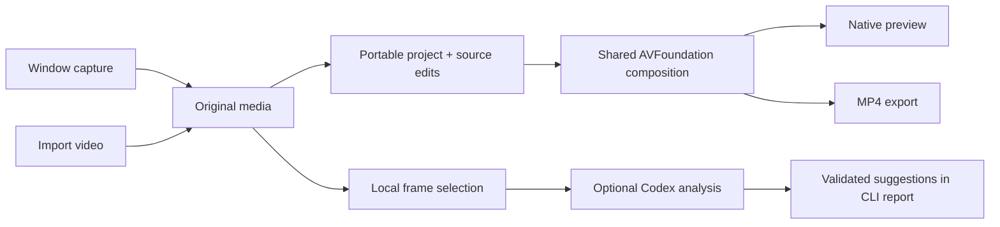

# Architecture

Takelet is a Swift package with a native app and two developer executables. No server is required for the editor.

| Module | Responsibility |
| --- | --- |
| `TakeletApp` | SwiftUI editor, AppKit player, native dialogs, document state, menus and undo |
| `ProjectCore` | Versioned model, validation, source/output time mapping and portable storage |
| `MediaEngine` | ScreenCaptureKit window recording, AVFoundation composition/export and Core Image framing |
| `AnalysisCore` | Frame manifests, candidate/protected ranges, model-result validation and JSONL transport |
| `TakeletAnalyze` | Frame preparation and optional local Codex app-server orchestration |
| `MediaCheck` | Synthetic fixture generation, project round-trip, render and audio checks |



The analysis report is separate from the editor. A future UI will let the user review suggestions before creating project edits.

## Time model

Cuts, zoom bounds and cursor samples use **source seconds**. Preview and export use **output seconds**. Cuts are half-open source intervals: a cut from 2 to 3 removes `[2, 3)`.

For a six-second source with that cut, output time 2 maps to source time 3; output time 4 maps to source time 5. A time inside the removed interval has no output position. `Project` owns both mappings so video, audio and visual effects follow the same edit decisions.

Audio track intersections are inserted at corresponding output positions. The zoom evaluator converts each output frame back to source time. Cursor metadata remains attached to the source; the current renderer does not draw a replacement cursor.

Future speed changes and narration holds require an explicit piecewise time map. A hold advances output time while keeping one source frame. Moving audio independently to fit narration would violate this model.

## Rendering

`CompositionBuilder` creates retained AVMutableComposition tracks and a Core Image video composition. It fits the source without stretching, adds padding/background, and applies a smooth focus zoom inside the fitted viewport.

Preview uses a 1280×720 composition and `AVPlayerView`. Export uses the same builder at 1920×1080 or 3840×2160, with a 1/30-second frame duration. Export writes a temporary sibling file and moves it into place only after completion. Existing destinations are preserved.

## Project package

```text
Example.takelet/
  project.json
  media/
    source.mov
```

Schema version 1 stores a title, source dimensions/duration, cut intervals, one zoom, background preset, padding and cursor samples. Older documents without a background field decode as Midnight, preserving their previous appearance. Media is copied without transcoding; the fixed `.mov` filename can contain an imported MP4 container that AVFoundation detects from its contents.

Metadata saves are atomic. Package creation copies media into a temporary sibling directory, then renames it into place. Loading validates schema, bounds, cuts and source paths, rejecting missing sources and symlink escapes. This is not a cryptographic integrity format; external asset edits can invalidate a project.

Credentials, analysis reports and provider account data are not project fields. Future generated narration will be a local media asset, with credentials in per-user secure storage.

## Capture

The first recorder uses ScreenCaptureKit's independent-window filter and direct H.264/MP4 recording output. It requests 30 fps and caps dimensions within 3840×2160. Microphone and system audio are optional. Cursor position and sampled left-button state are collected on a serial frame callback queue.

The system cursor is currently baked into the image. Metadata timing, moving-window geometry, very short clicks and live microphone synchronization require further validation. Separate audio stem controls, area/display capture and a clean cursor layer are future work.

## AI and workflow reuse

The analyzer owns media preparation and validates structured results; the model does not execute edits. See [AI analysis](AI_ANALYSIS.md) for authentication, privacy and protocol limits.

Existing video-production workflows informed frame timestamp indexing, evidence-linked descriptions, segment-level narration retakes and audio alignment checks. The native implementation does not require a personal skills folder. Python/FFmpeg and Remotion workflows are design references rather than bundled runtime dependencies.
