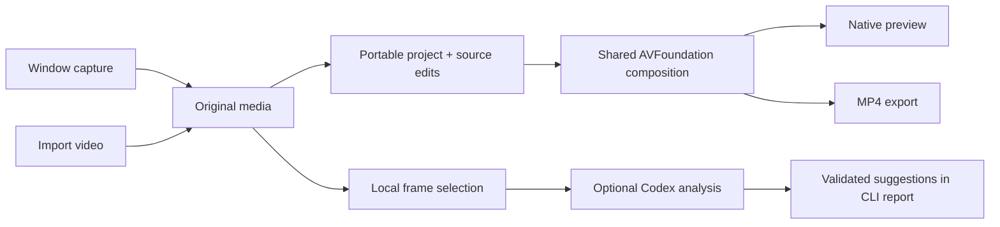

# Architecture

Takelet is a Swift package with a native app and two developer executables. No server is required for the editor.

| Module | Responsibility |
| --- | --- |
| `TakeletApp` | SwiftUI editor, AppKit player, native dialogs, document state, menus and undo |
| `ProjectCore` | Versioned model, validation, source/output time mapping and portable storage |
| `MediaEngine` | ScreenCaptureKit window recording, AVFoundation composition/export and Core Image framing |
| `AnalysisCore` | Frame manifests, candidate/protected ranges, model-result validation and JSONL transport |
| `NarrationCore` | ElevenLabs voice/TTS client, bounded cancellable HTTP, provider errors and Keychain storage |
| `TakeletAnalyze` | Frame preparation and optional local Codex app-server orchestration |
| `MediaCheck` | Synthetic fixture generation, project round-trip, render and audio checks |



The analysis report is separate from the editor. A future UI will let the user review suggestions before creating project edits.

## Time model

Cuts, zoom bounds and cursor samples use **source seconds**. Preview and export use **output seconds**. Cuts are half-open source intervals: a cut from 2 to 3 removes `[2, 3)`.

For a six-second source with that cut, output time 2 maps to source time 3; output time 4 maps to source time 5. A time inside the removed interval has no output position. `Project` owns both mappings so video, audio and visual effects follow the same edit decisions.

`NarrationTimeline` derives moving spans, frozen-frame holds and speech placements
from cuts and source-time narration intervals. Longer speech adds exactly its excess
duration after the interval's last retained piece; shorter speech leaves the video
duration intact. Holds advance output time while keeping one source frame. Mapping
source to output selects its moving occurrence, never a repeated hold.

Original audio intersections are inserted only in moving spans. Narration tracks
start at their derived output positions. Cursor and zoom rendering evaluate the
same output-to-source map, including holds. Preview and export share an audio mix.

## Rendering

`CompositionBuilder` creates retained AVMutableComposition tracks and a Core Image video composition. It fits the source without stretching, adds padding/background, and applies a smooth focus zoom inside the fitted viewport.

Preview uses a 1280×720 composition and `AVPlayerView`. Export uses the same builder at 1920×1080 or 3840×2160, with a 1/30-second frame duration. Export writes a temporary sibling file and moves it into place only after completion. Existing destinations are preserved.

## Project package

```text
Example.takelet/
  project.json
  media/
    source.mov
    cursors/<UUID>.png
    narration/<UUID>.mp3
```

Schema version 3 stores a title, source dimensions/duration, cut intervals, a `zooms`
array, background preset, padding, cursor samples/mode/style, narration segments,
and source/narration volume. Each zoom has a stable UUID,
source start/end, scale and normalized focus. Up to 512 intervals are accepted;
duplicate IDs, overlaps, non-finite values and out-of-range settings are rejected.
Touching intervals are allowed. Rendering selects the interval containing the
source frame, or uses the original fitted view outside all zooms.

Version-1 documents migrate in memory: an active legacy `zoom` becomes one interval
with the same curve and focus; a disabled 1× zoom becomes an empty array. Missing
background fields still decode as Midnight. Versions 1 and 2 default to an embedded
cursor, no narration and unchanged audio levels. Saving emits only format 3, which the
0.1.0 app rejects rather than silently losing newer edits. No source media changes
during migration. Media is copied without transcoding; the fixed `.mov` filename
can contain an imported MP4 container that AVFoundation detects from its contents.

Metadata saves are atomic. Package creation copies media into a temporary sibling directory, then renames it into place. Loading validates schema, bounds, cuts and source paths, rejecting missing sources and symlink escapes. This is not a cryptographic integrity format; external asset edits can invalidate a project.

Generated audio and custom PNGs use immutable UUID filenames. Save copies required
assets before atomically replacing metadata; collisions with different bytes fail.
Unused assets may remain so Undo/Redo can restore a replaced take. Each segment
stores its script, voice/model/language and measured audio duration. Changing speech
settings clears the generated reference; timing edits reuse it. Up to 128 segments,
10,000 script characters per segment, 30 minutes per audio asset, and one hour of
finished output are accepted; provider/model request limits may be lower.

Credentials, analysis reports and provider account data are not project fields.
The ElevenLabs key is a device-only macOS Keychain item; voice/language preferences
contain no key. Explicit generation sends the script/settings, not video or cursor
images. Cancellation and provider errors preserve the previous generated take, and
an uncertain synthesis request is not automatically retried.

Inspector drafts live in `Workspace`, independently of conditional SwiftUI views.
They contribute to document dirty state and are committed atomically before Save,
Export or Generate. Invalid pending intervals prevent the operation instead of saving
partial controls or sending stale text to a paid provider.

## Multiple zooms and click-based Auto Zoom

`ZoomPlanner` creates manual intervals in the uncut, unoccupied range around the
source playhead. A manual addition lasts up to two seconds and stays inside its
available range. The inspector can subsequently edit source timing explicitly,
including intervals spanning a cut; source-time rendering remains authoritative.

Auto Zoom runs only on request. A visible sampled mouse-down edge proposes a 1.6×
zoom focused at that sample, starting up to 0.4 seconds before and ending up to
1.2 seconds after it. Bounds are clipped to retained footage and neighboring zooms.
Intervals shorter than 0.8 seconds are skipped. Held buttons, out-of-frame clicks,
clicks inside cuts and clicks already covered by zooms are ignored. Nearby clicks
share the first interval and its focus. This is a deterministic local heuristic,
not visual AI analysis or continuous cursor following.

Generated intervals become ordinary editable zooms. The workspace adds the whole
batch as one undo operation and never replaces existing intervals. Repeating Auto
Zoom is idempotent while those intervals remain. Each selection, inspector edit,
removal and export uses the same stable ID and source-time model.

## Capture

The first recorder uses ScreenCaptureKit's independent-window filter and direct H.264/MP4 recording output. It requests 30 fps and caps dimensions within 3840×2160. Microphone and system audio are optional. Cursor position and sampled left-button state are collected on a serial frame callback queue.

New recordings set `showsCursor = false`. A serial 30 Hz timer samples position and
left-button state independently of changing video frames, using the stream clock
and first complete frame as the time anchor. Old/imported footage remains embedded.
The renderer caches a vector or decoded PNG sprite and adds it before zoom/framing;
hidden, out-of-frame and stale samples never invent cursor motion or clicks.

The first encoded timestamp is not exposed by `SCRecordingOutput`. Live frame-zero
skew, moving-window geometry, very short clicks and microphone synchronization need
device testing. Independent microphone/system-audio stem controls and area/display
capture remain future work.

## AI and workflow reuse

The analyzer owns media preparation and validates structured results; the model does not execute edits. See [AI analysis](AI_ANALYSIS.md) for authentication, privacy and protocol limits.

Existing video-production workflows informed frame timestamp indexing, evidence-linked descriptions, segment-level narration retakes and audio alignment checks. The native implementation does not require a personal skills folder. Python/FFmpeg and Remotion workflows are design references rather than bundled runtime dependencies.
